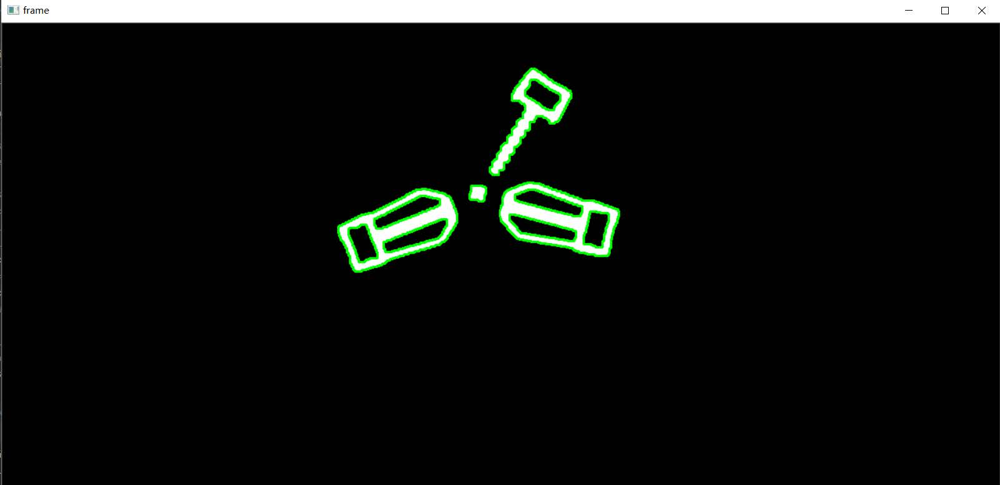
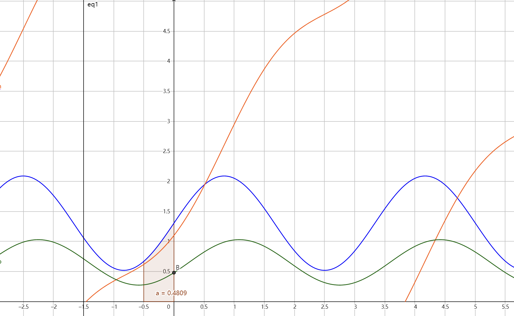

本项目是海南大学RoboMaster 2021 单项赛 步兵竞速与智能射击的视觉代码，本程序**只能击打大能量机关**。本项目的特点是用QT编写图形化UI，可即时显示图像处理结果并将各中间结果绘制成曲线图，采用线程池对采集的图像进行并行处理，效率较高。可通过UI直接调整自瞄参数，方便快捷。程序采用骆峰式命名法（QTcreator生成的槽函数默认采用下划线分割），注释详细，所有需要根据实际情况修改的地方都用TODO标记了。

联系方式：QQ 3326721592

## 概况

| 处理设备 | Intel NUC NUC10i7FNK |
| -------- | ------------------------ |
| 相机 | 大恒MER-139-210U3C |
| 镜头 | HN-P-0628-6M-C1-1.8 （6mm焦距） |
| 相机位置 | 云台，枪管下方 |
| 操作系统 | Ubuntu 18.04 LTS |
| 软件框架 | QT 5.12.9 |
| 开发环境 | QTcreator 或 Jetbrains Clion |
| 采集帧率 | 150fps |
| 分辨率 | 默认600x800（更改需重新标定相机） |
| 串口波特率 | 115200 |

## 通信格式

```c++
//NUC发送帧，STM32接收帧
struct __attribute__((packed)) SendFrame
{
    uint16_t head=0xaaaa;   	 //帧头
    float pitchAngleSet=0.0f;    //pitch轴角度设定值
    float yawAngleSet=0.0f;      //yaw轴角度设定值
    float targetAngle=0.0f;      //目标装甲板角度
    uint8_t shootCommand=0;      //发射指令
};
//NUC接收帧，STM32发送帧
struct __attribute__((packed)) RecvFrame
{
    uint16_t head=0xbbbb;           //帧头
    float pitchAngleGet;            //pitch轴编码器角度
    float yawAngleGet;              //yaw轴编码器角度
    uint8_t rotateDricetion = true; //旋转方向,默认顺时针
    float timeBais;                 //预测时间偏置，实际未使用
    float compensateBais;           //弹道补偿偏置，实际未使用
    uint8_t gimbal_mode;	    //云台模式
};
```

## 软件依赖库

OpenCV3 or OpenCV4、ceres-solver-2.0.0、QT5.12.9、QCustomPlot、cmake 3.5

安装ceres-slover库：

```shell
chmod +x ./install-ceres.sh
sudo ./install-ceres.sh
```


## 识别原理

预处理部分主要参考了[Raring_Ringtail大佬的博文](https://blog.csdn.net/u010750137/article/details/100825793)

具体识别则既没有采用模板匹配也没有采用SVM，而是根据轮廓层级的关系进行初筛。可以看到“锤子型”只有一个子轮廓，而“宝剑”则有三个。之后则对每个没有兄弟轮廓的子轮廓求最小外接矩形，通过面积、长宽比、轮廓面积与最小外接矩形面积的占比（与矩形的相似度）来筛选出目标装甲板。之后再根据距离目标装甲板的距离和锤子柄所指的方向以及面积大小筛选出中心的R作为旋转中心。



## 预测原理

主要原理是利用Google的ceres-slover非线性优化库拟合得到当前能量机关旋转的相位 ，因而无需等待能量机关旋转速度达到极大值或极小值。在实际测试中由于采集帧率较高，如果采用相邻两帧的能量机关角度计算角速度，在能量机关转速较慢时两帧识别出的目标装甲板角度经常不变，导致出现0速度，对拟合引入误差。因而采用了间隔0.5s的两帧间能量机关的角度差作为拟合的原始数据（若跳符则折算到跳转前计算角度差）。
若采集最后一个角度差样本时能量机关旋转的角度式为：


则需要拟合的式子为，其中 τ=0.5s ，t来自于相机采集的时间戳：




实际测试时采集1.5s内的角度差样本进行拟合得到的相位较为准确。由于当 τ=0.5s 时，上式（图中绿色曲线）取值不超过 1.5π ，因而添加样本时可以此滤除一部分非预期的数据，确保拟合得到的相位准确可信。

## 击打原理

由于电控程序相对简陋，若直接根据击打延迟给出运动的预测点并用小孔成像原理结算云台角度发送给下位机会导致云台剧烈抖动，加入低通滤波或套一层PID会增加延迟，导致击打不及时。因而折衷选择给一个相对能量机关中心静止的预测点进行瞄准，结算出角度后套一层PID再发给下位机。由于能量机关每2.5s跳转一次，于是最终选择每次跳变后先给出`2s`后的预测位置，下一次迭代式给出 `2s-迭代间隔时间`后的预测位置，因此在这2s内预测点理论上应当相对于能量机关中心静止，有充足的时间等待误差收敛。之后根据预测的旋转角速度确定击发的提前时间。由于单项赛的弹速上限较高，且击打位置相对固定，重力补偿采用了固定值。

## 运行截图


左侧为实时更新的采集到的原始图像（黄圈是能量机关最小半径，青蓝圈是最大半径，粉圈是中心R的最大半径，绿色矩形是目标装甲板的最小外接矩形，红点是目标装甲板中心，黄点是预测的击打点）可切换到经过预处理后的二值图，便于调整阈值和膨胀核大小。中上方为实时更新的数据，中间是曲线图，其中深蓝色为实测的锤子角度，浅蓝色为跳符后折算到跳符前的角度（理想情况当然是能和深蓝的线接上），黑线是间隔0.5的两帧的角度差，绿线是非线性拟合得到的正弦转速函数的相位，橘线是根据拟合得到的相位预测的能量机关的旋转角速度。底部是模式选项和按键，模式可控制云台瞄准预测点或者当前目标（打定点时用），或者采用视频代替相机；按键可控制程序打开或关闭相机或视频，可同时录像并保存，可手动控制发射。右侧则为程序的主要参数，可实时修改。

## 各类主要功能说明
| 类名            | 功能                                                         |
| -------------- | ------------------------------------------------------------ |
| AngleSolver    | 角度解算类                                                   |
| Camera         | 相机包装类，封装了大恒的API和采用视频时模拟相机              |
| ChartPainter   | 曲线图绘制类，继承自QCustomPlot                              |
| ImageProcessor | 图像处理类                                                   |
| MainWindow     | 主窗口类，包含各UI控件，负责PID迭代和控制发射时机            |
| Predictor      | 预测类，计算角度差并拟合得到相位。根据拟合的相位给出预测位置和角速度 |
| Pid            | PID类                                                        |
| Transceiver    | 串口收发类                                                   |
| Target         | 能量机关目标类，储存每帧识别到的能量机关信息                 |

## 未来优化方向

程序的拟合得到的相位基本准确，但由于采用固定2s的间隔时间击打，因此激活的时间最小也在10s以上，计划进一步优化电控和视觉的衔接，使云台能够跟随能量机关移动，取消固定击打间隔，改用阈值判断，当云台角度与解算角度误差小于阈值时则击发。并加入自动识别能量机关旋转方向。

## 致谢

佛山科学技术学院、深圳大学、吉林大学
